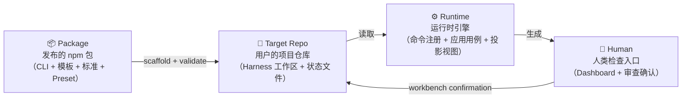
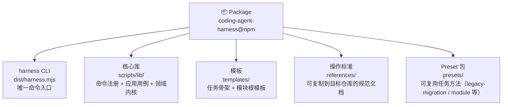
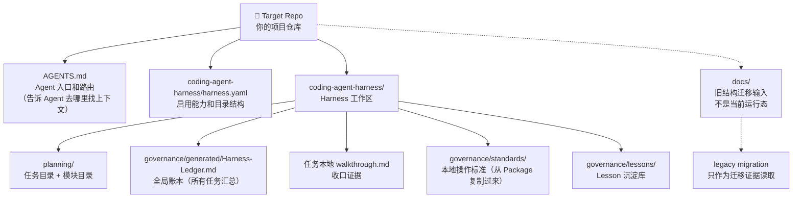
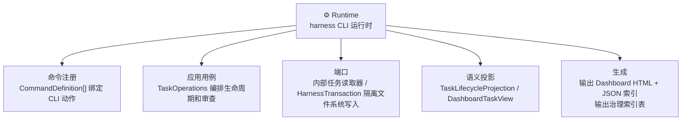

# 01 — 系统全景

## 这是什么，解决什么问题

在 AI 编程工具（Codex、Claude Code、Gemini CLI）普及之前，
"任务管理"对开发者来说意味着 Jira ticket 或 GitHub issue——
这些工具是为人类设计的，Agent 读不懂，也无法从中派生出可验证的状态。

**Coding Agent Harness** 解决的核心问题是：

> 当 Agent 在你的代码仓库里工作时，如何确保它的工作有迹可查、有门可守、有人可审？

它不是 Agent 本身，也不是给人用的任务管理工具。
它是一个**仓库原生的 Agent 操作层**（repository-native operating layer）——
给 Agent 提供可执行的结构化上下文，让 Agent 能从文件中恢复执行，
而不依赖之前的聊天记忆。

核心设计理念只有一句话：

> **把重要状态保存在 Agent 能读的 Markdown 文件里，然后用 CLI 从这些文件派生出
> 状态、检查、迁移计划和 Dashboard 视图。**

---

## 为什么叫 "Harness"

"Harness"在工程语境中是"约束装置"的意思——用来约束、引导、测量一个系统的行为，
而不是替代它。就像测试框架中的 "test harness" 不是测试本身，
而是让测试可以被组织、执行和验证的基础设施。

Coding Agent Harness 不是 Agent 的替代品，而是 Agent 的约束装置：
- 任务有生命周期（创建 → 执行 → 审查 → 收口）
- 审查有门禁（Agent 不能自己给自己打通关）
- 状态有记录（每次变更都写入 Markdown，可 git blame）
- 人类有检查入口（本地 Dashboard + Workbench 审查确认）

---

## 和 Jira / Linear / GitHub Issues 的本质区别

| | Jira / Linear / GitHub Issues | Coding Agent Harness |
| --- | --- | --- |
| 设计给谁 | 人类协作 | Agent 执行 + 人类审查 |
| 状态存在哪 | 外部 SaaS 数据库 | 仓库内的 Markdown 文件 |
| Agent 能读吗 | 需要 API 集成 | 直接读文件 |
| 能 git diff 吗 | 不能 | 可以 |
| 能离线工作吗 | 不能 | 可以 |
| 能从文件恢复执行吗 | 不能 | 可以 |

---

## Level 0 — 四个大块

先看最高层。整个系统由四个大块组成：

- **Package**：你 `npm install` 的那个东西，包含 CLI、模板、标准文档、Preset 包
- **Target Repo**：你的项目，harness 在里面创建 `coding-agent-harness/` 工作区来记录任务状态
- **Runtime**：CLI 运行时，通过命令注册、应用用例、仓储端口和语义投影生成可审查视图
- **Human**：浏览器里看 Dashboard，在 Workbench 里做审查确认

注意这个循环的方向：**Package 写入 Target Repo，Runtime 读取 Target Repo，
Human 通过 Workbench 人工确认再写回 Target Repo**。
整个系统是一个以 Markdown 文件为中心的读写循环，没有任何隐藏状态。

---

## Level 1 — 每个大块里有什么

### Package 里有什么

Package 是**只读的**——它提供工具和模板，但不存储任何状态。
状态全部在 Target Repo 里。

### Target Repo 里有什么

每个任务对应 `coding-agent-harness/planning/tasks/<task-id>/` 下的一个目录，
里面有 `task_plan.md`、`progress.md`、`visual_map.md`、`review.md` 等文件。
模块注册在 `harness.yaml` 的 `modules.items`；模块根目录默认只包含
`brief.md` 和 `module_plan.md`，模块任务放在
`coding-agent-harness/planning/modules/<key>/tasks/<task-id>/`。

如果目标仓库还存在根目录 `docs/`，它属于旧结构迁移输入或历史证据，
不是 v2 运行态的 Reference 文档和项目标准来源。

### Runtime 做什么

Runtime 是**无状态的**——每次运行都从 Markdown 文件重新读取。
Dashboard、Workbench 队列和治理索引都是从任务源文件派生出来的投影视图，
不是第二套事实来源。
repository 读取器、scanner adapter 和生成的 `dist/lib/*` 模块都是运行时内部实现，
不是公开 package API。公开使用入口是 `harness` CLI、内置 preset、模板和生成视图。

---

## Level 2 — 核心概念词汇表

| 概念 | 一句话解释 | 在哪里 |
| --- | --- | --- |
| **Task** | 一个有生命周期的工作单元 | `coding-agent-harness/planning/tasks/<id>/` |
| **Budget** | 任务复杂度：`simple` / `standard` / `complex`，决定门禁严格程度 | `task_plan.md` |
| **Phase** | Visual Map 中的执行阶段，有状态和完成度 | `visual_map.md` |
| **Capability** | 可选功能模块，如 `dashboard`、`module-parallel` | `coding-agent-harness/harness.yaml` |
| **Module** | YAML 注册的并行工作域，带 owner、scope、依赖和任务分组 | `harness.yaml modules.items` + `planning/modules/<key>/` |
| **Review Gate** | 阻止任务完成的审查门禁，必须人工确认才能通过 | `INDEX.md` + `review.md` |
| **Governance Sync** | 任务状态变更时自动更新全局账本的原子操作 | `coding-agent-harness/governance/generated/Harness-Ledger.md` |
| **Preset** | 可复用的任务方法包，如 `legacy-migration`、`module` | `presets/<id>/` |
| **Lesson** | 从任务中沉淀的可复用经验 | `coding-agent-harness/governance/lessons/` |
| **Tombstone** | 软删除 / 合并 / 被取代的任务标记 | `task_plan.md` 中的特殊块 |
| **lifecycleState** | 从任务状态 + 审查状态综合派生的队列分类 | 运行时派生，不存文件 |

---

## Level 2 — 设计决策

### 为什么用 Markdown 而不是数据库

这是最常被问到的问题。

**选择 Markdown 的原因**：

1. **Agent 可读**：所有主流 AI 编程工具都能读写 Markdown，不需要特殊 API
2. **Git 原生**：状态变更可以 diff、可以 blame、可以回滚，审计链天然存在
3. **人类可读**：不需要工具就能直接查看状态，降低工具依赖
4. **离线工作**：不依赖外部服务，断网也能用
5. **可移植**：换 Agent 工具不需要迁移数据
6. **单一事实源**：避免 Markdown、JSON、SQLite 三份事实互相漂移

**代价**：

- 解析 Markdown 比查数据库慢（但对于任务管理规模，这不是瓶颈）
- 格式约束需要靠检查器维护，而不是数据库 schema 强制
- 并发写入需要文件锁（`governance-sync` 的锁机制）

**被考虑但否决的方案**：
- **SQLite**：Git diff 不友好，引入二进制文件，且当前规模（几百任务）不需要
- **JSON**：适合机器解析但不适合 Agent 理解叙述性上下文
- **YAML/TOML**：不适合承载 brief、执行策略这类长文本内容

### 为什么是 npm 包而不是 SaaS

Agent 需要在本地文件系统上读写状态。SaaS 会引入网络依赖、认证、延迟，
破坏 Agent 的自主执行能力。npm 包让任何能运行 Node.js 的环境都能直接使用，
无需账号或网络。`package.json` 的 `dependencies` 为空——零运行时依赖。

### 为什么人工确认必须只在 Workbench 里操作

人工确认是整个系统里**唯一不能由普通 CLI 暴露给 Agent 的操作**。

原因：

> Agent 不能给自己的工作打通关。

这个边界不是一开始就有的。最初 Dashboard workbench 的 review action 没有 Agent/Human 区分。
后来通过竞品分析（Taskr competitive intake）识别出"Agent 自动确认 review"是 P0 风险，
才引入了 Workbench 写入口和 Git 提交门禁：Dashboard workbench 会把带有 Git `user.name` / `user.email` 的
人工确认审计字段写入任务 `INDEX.md`，并做两次 Git 原子提交——第一次提交确认字段，
第二次提交包含第一个 commit SHA 的最终审计记录。这个 Git commit 是**可审计的人类签名**，
证明有真实的人类看过这个任务。

### 为什么派生状态不存储在文件里

`lifecycleState`、`taskQueues`、`reviewQueueState` 这些派生状态每次运行时重新计算，
不写回 Markdown 文件。原因有三：

1. **避免事实漂移**：如果派生状态也写回文件，就有了两份事实源，任何一份过期都会造成误报
2. **防止绕过门禁**：如果 Agent 能直接修改派生字段，就能绕过人工确认门禁
3. **治理规则即代码**：scanner 的推导规则本身就是治理规则的机器可读表达，每次运行重新计算等于每次都重新执行一遍治理检查

---

## 下一步

- 想理解代码怎么组织的 → [02-module-dependency.md](02-module-dependency.md)
- 想理解一个任务从头到尾怎么走 → [03-task-lifecycle.md](03-task-lifecycle.md)
- 想理解检查器在验什么 → [04-check-and-governance.md](04-check-and-governance.md)
- 想理解 Dashboard 数据从哪来 → [05-data-flow.md](05-data-flow.md)
- 想理解 Preset 和迁移怎么工作 → [06-preset-and-migration.md](06-preset-and-migration.md)
