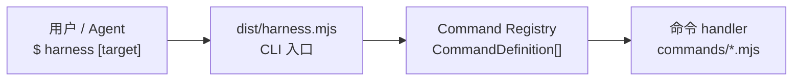
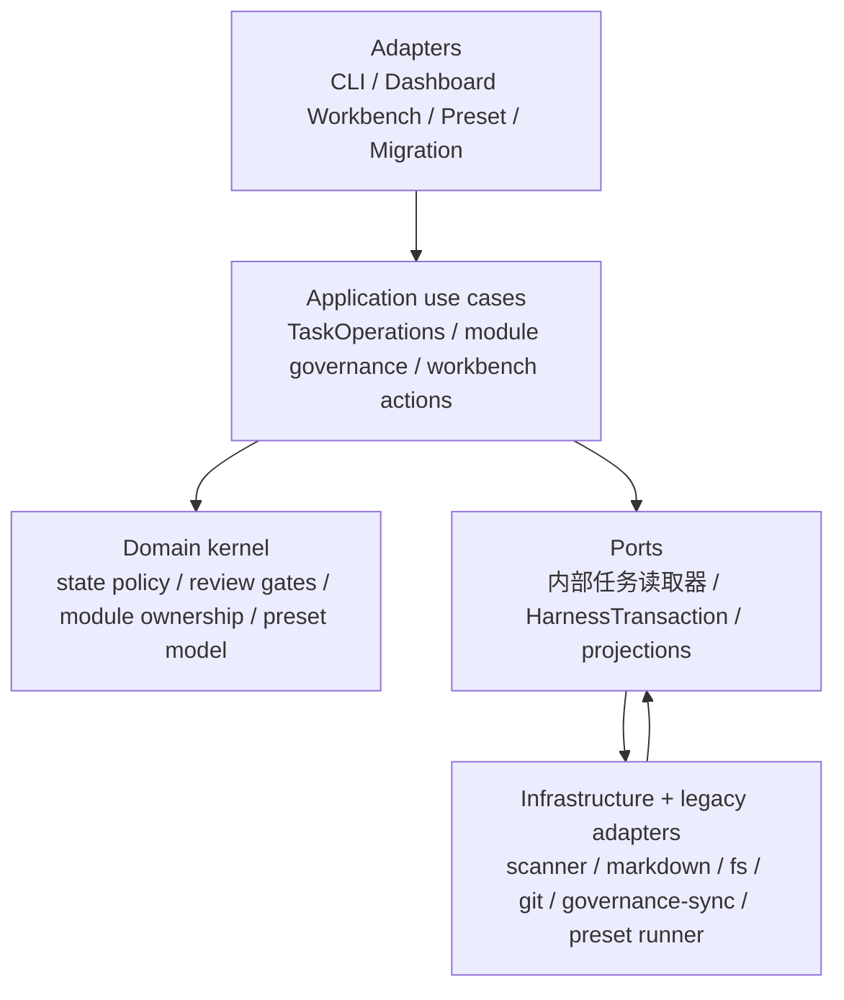
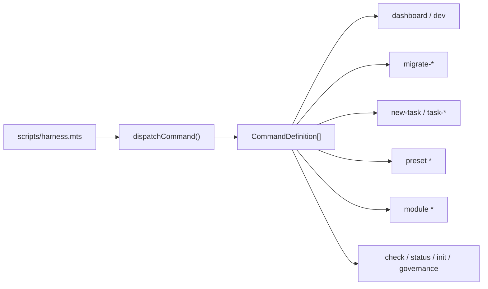
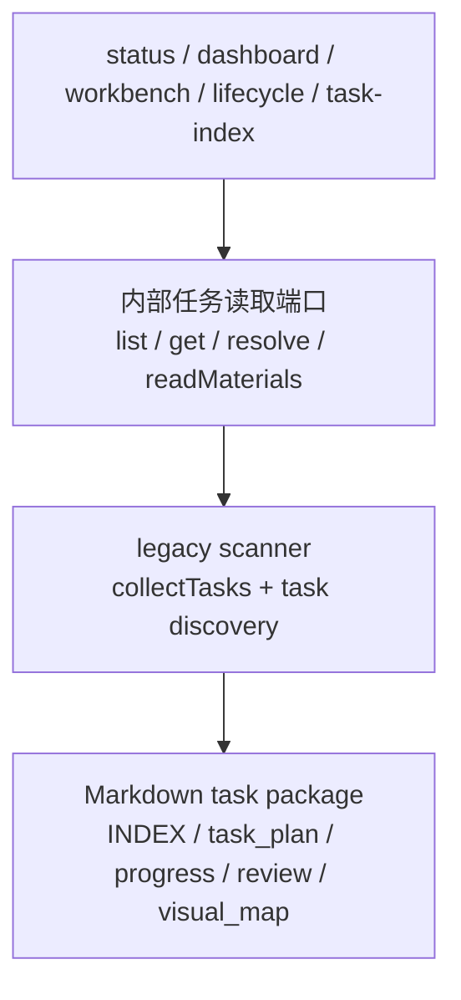
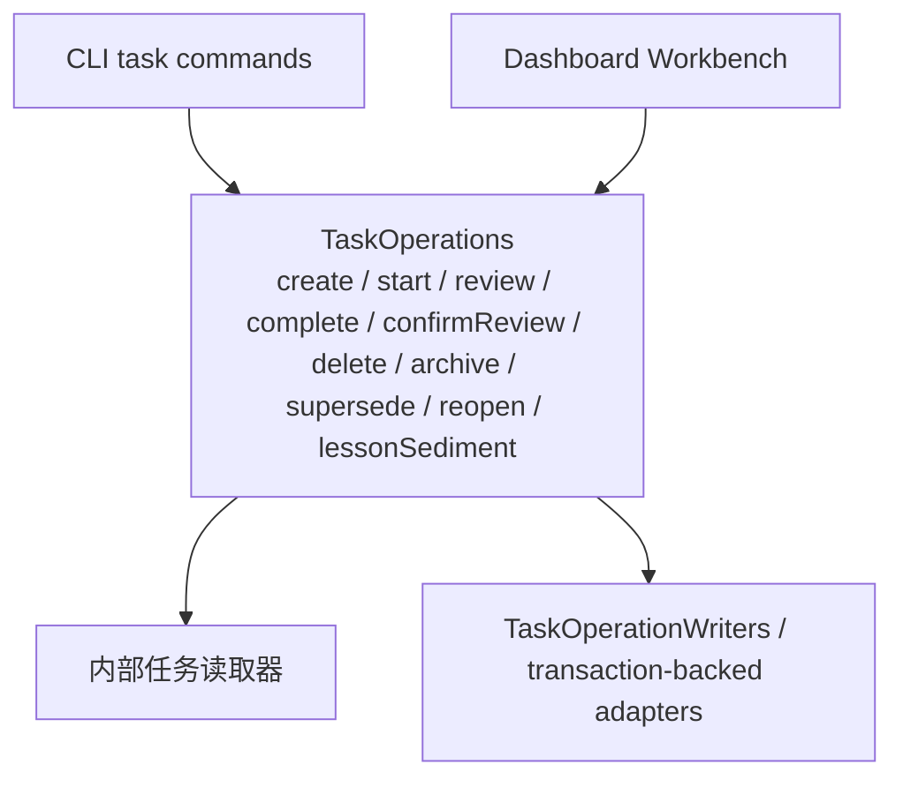
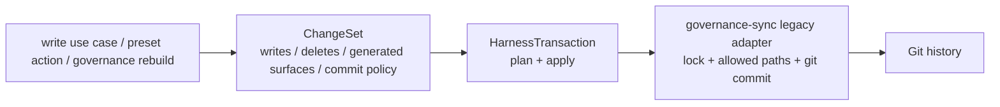
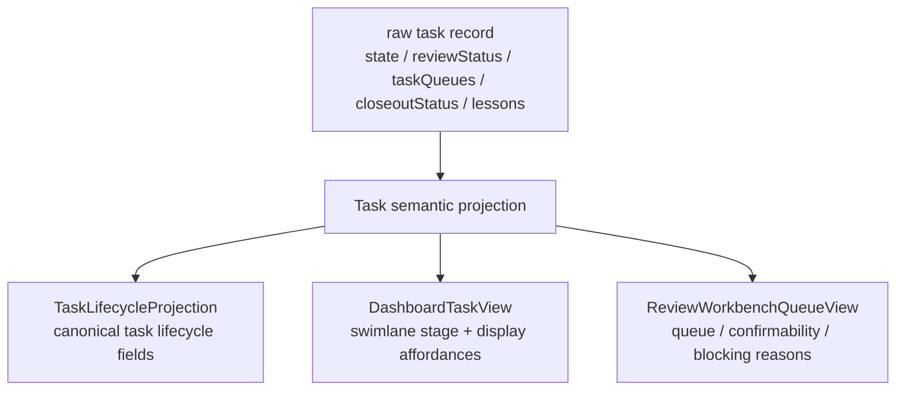

# 02 — 代码模块依赖关系

## Level 0 — 入口在哪

所有命令都从一个文件进来：

`harness.mjs` 只负责把参数交给 command registry。命令名称、usage、flags、
positionals 和 handler 都注册在 `CommandDefinition` 里；help 输出也从注册表生成。
这让新增命令从“改多个 if/else 和手写 help”收敛成“加一个定义和一个 handler”。

---

## Level 1 — 当前分层

底层重构后的公开架构不是“六个平级功能模块”，而是一个 facade-first 的
ports/adapters 结构。旧 scanner、governance-sync、preset runner 仍然存在，但它们被
当作 infrastructure / legacy adapter 接入，而不是让 CLI 或 Dashboard 直接绕过业务层。

依赖方向是向内的：adapter 负责协议和呈现，application 负责业务动作，domain
负责规则，ports 定义边界，infrastructure 实现文件系统、Git、Markdown 和遗留扫描能力。

---

## Level 2 — 命令注册表

`commands/registry.mts` 是命令面的 source of truth。它声明每个命令的名称、usage、
flag schema、positionals 和 handler。复杂命令仍分发到 `dashboard-command.mts`、
`migration-command.mts`、`task-command.mts`、`preset-command.mts` 和
`module-command.mts`，但注册和 help 不再散落在入口文件里。

---

## Level 2 — 任务读路径：内部读取器

任务读取端口是内部读缝。scanner-backed 实现可以继续藏在 adapter 后面，但 active
调用方应依赖语义任务视图，而不是 scanner discovery 细节。内部读取器提供四类能力：

| 方法 | 用途 |
| --- | --- |
| `list(query)` | 列出任务并应用 state、module、queue、preset、review、lesson 等查询条件 |
| `get(ref)` | 用 id 或路径取一个任务 |
| `resolve(ref)` | 把任务引用解析成目录和 `task_plan.md` 路径 |
| `readMaterials(ref)` | 读取任务包中可审查的 Markdown 文件 |

这个 adapter 让以后替换 scanner 内部实现时，不需要逐个改 Dashboard、Workbench、
check 和 lifecycle 调用方。它不是公开 package import surface；消费者应使用 CLI、
生成 JSON、Dashboard 输出或已文档化的 preset/template 入口。

---

## Level 2 — 任务写路径：TaskOperations

`TaskOperations` 是 application use-case 层。CLI 和 Dashboard Workbench 都通过它做任务动作，
所以“能不能确认 review”“能不能 task-complete”“open blocking findings 是否阻断”等规则不会在多个入口分叉。

写入相关 compatibility module 由 adapter 拥有并受 transaction scope 约束；
它们不是 CLI 或 Dashboard 调用方的业务接口。

---

## Level 2 — 写入事务：HarnessTransaction

`HarnessTransaction` 把写入计划、allowed paths、generated surfaces、dirty tree 检查、
dry-run 语义和 Git commit 结果收进一个命名边界。它的核心类型是：

| 类型 | 作用 |
| --- | --- |
| `ChangeSet` | 声明本次操作要写、删、生成什么，以及 commit 策略 |
| `TransactionPlan` | 规范化后的计划，包含 allowed paths、generated surfaces、Git 状态和冲突 |
| `TransactionResult` | apply 后的成功/失败、写入列表、提交结果和 lock release 状态 |

这不是新的事实源。事务只管理写入安全和提交边界；任务事实仍然来自
`coding-agent-harness/` 下的 Markdown 文件。

---

## Level 2 — 语义投影：Task Semantic Projection

Task semantic projection 解决的是“同一个 review 概念在 status、Dashboard、Workbench、
generated indexes 中被多次解释”的问题。它把 raw task record 包成三个 view model：

| Projection | 消费者 | 不能做什么 |
| --- | --- | --- |
| `TaskLifecycleProjection` | status JSON、task-index、Dashboard、governance rows | 不能写回 source 文件 |
| `DashboardTaskView` | task list、detail drawer、swimlane | 不能在前端重新发明 lifecycle 规则 |
| `ReviewWorkbenchQueueView` | review workbench、批量确认动作、review queue 视图 | 不能从 Markdown 重新计算 blocking risks |

Projection 可以落盘或缓存为 generated JSON，但它不是权威事实源；删掉后必须能从任务文件重建。

---

## Level 3 — Legacy 模块仍然在哪里

很多文件名仍保留在 `scripts/lib/` 下，这是为了让重构可验证、可回滚，而不是一次性搬目录。
它们的当前角色如下：

| 模块 | 当前角色 |
| --- | --- |
| `task-scanner.mts` / `task-review-model.mts` | 内部任务读取器背后的 legacy read implementation |
| `governance-sync.mts` | HarnessTransaction 背后的 legacy write / commit adapter |
| `task-lifecycle.mts` | 仍执行部分 Markdown 写入，逐步由 TaskOperations 和 transaction 收口 |
| `dashboard-data.mts` / `dashboard-workbench.mts` | Dashboard adapter 和 projection consumer |
| `preset-runner.mts` | Preset adapter，逐步收敛到 ChangeSet / transaction 模式 |

阅读代码时，先找 adapter 调哪个 use case，再看 use case 依赖哪个 port。只有 port 的 legacy
实现内部才应该直接接触 scanner、Markdown 文件细节或 governance-sync。

---

## 下一步

- 想理解一个任务怎么走：读 [03-task-lifecycle.md](03-task-lifecycle.md)
- 想理解检查器和治理：读 [04-check-and-governance.md](04-check-and-governance.md)
- 想理解 Dashboard 数据流和 projection：读 [05-data-flow.md](05-data-flow.md)
