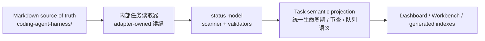
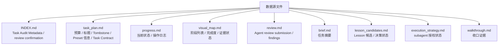
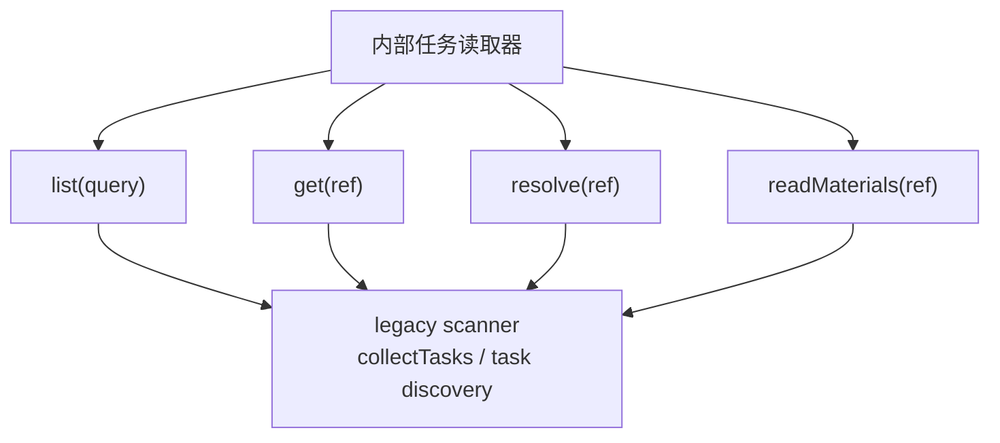
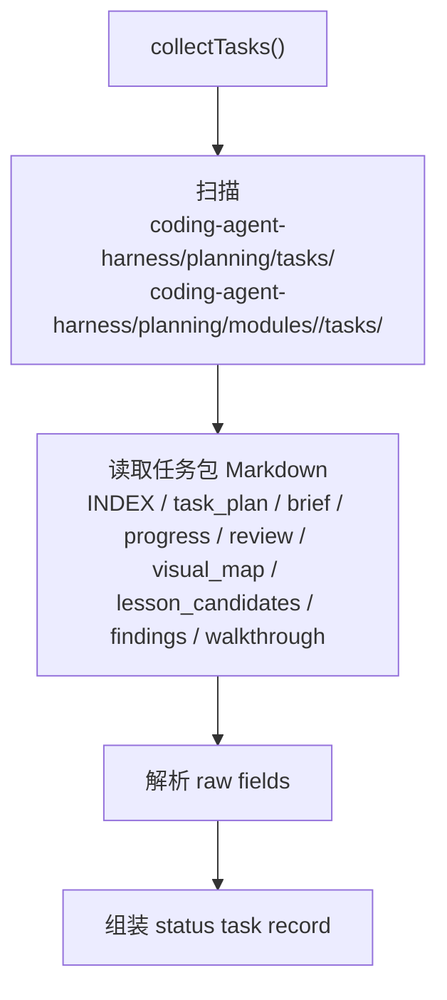
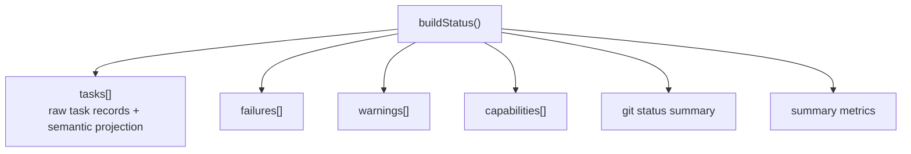
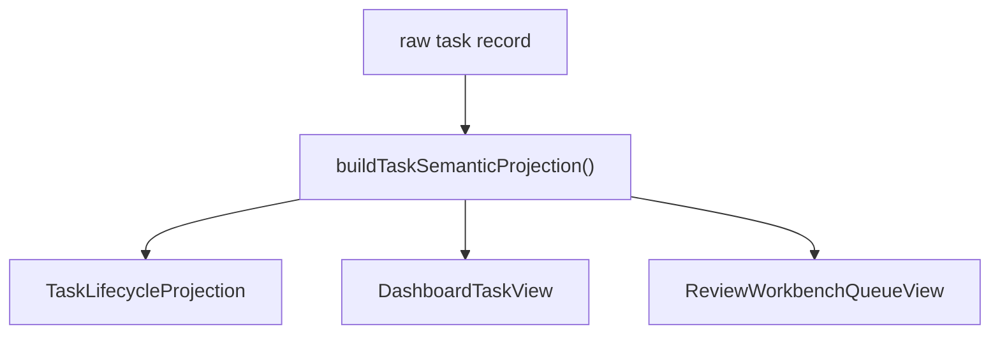
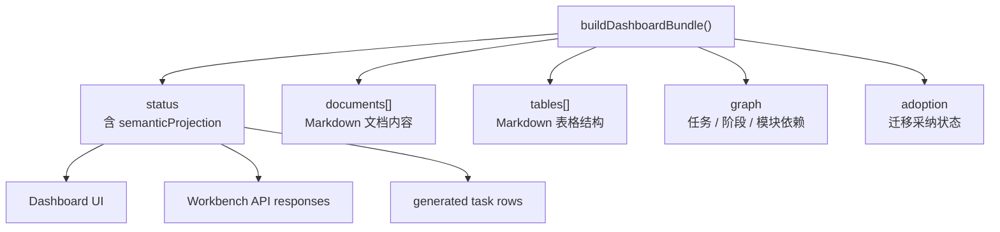
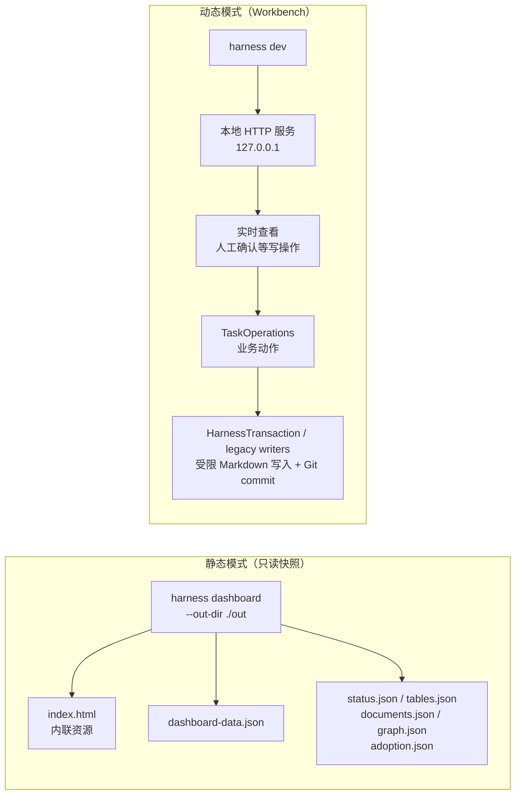

# 05 — 数据流：从 Markdown 到 Dashboard

## Level 0 — 数据的起点和终点

权威事实只在 `coding-agent-harness/` 下的 Markdown 文件里。Scanner、status JSON、
Dashboard bundle、generated indexes 和 projection 都是可再生视图；它们可以缓存或落盘，
但不能成为第二事实源。

---

## Level 1 — 哪些文件是数据源

生成的 `Harness-Ledger.md`、task-index、module-index、Closeout index 和 Dashboard JSON
不是手写 source。它们用于浏览、审查和恢复上下文，但必须能从 source 文件重建。

---

## Level 2 — 内部任务读取器如何读取任务

内部任务读取器在需要时包装 scanner-backed discovery。公开和 application 调用方应该看到
语义任务视图和可审查材料，而不是 `listTaskPlanPaths()`、目录排除规则、
legacy visual map fallback 等内部细节。

### 任务发现流程

scanner 仍作为 infrastructure adapter 解析 Markdown 表格、状态、阶段、review submission、
confirmation、lesson decision 和 tombstone。重构后的边界是：UI、命令面和 generated surface
不能各自重新解释这些 raw fields。

---

## Level 2 — status 输出是什么

`buildStatus()` 从 repository/scanner 结果和验证器结果组装机器可读状态：

每个 task record 仍保留 raw 字段，例如 `state`、`reviewStatus`、`reviewQueueState`、
`taskQueues`、`closeoutStatus`、`materialsReady` 和 `lessonCandidateDecisionComplete`。
这些字段便于调试，但 Dashboard 和 generated governance rows 应优先消费 semantic projection。

---

## Level 2 — Task Semantic Projection

Projection 将一个 raw task record 包成三个明确视图：

| Projection | 核心字段 | 消费者 |
| --- | --- | --- |
| `TaskLifecycleProjection` | `state`, `lifecycleState`, `reviewStatus`, `reviewQueueState`, `closeoutStatus`, `taskQueues`, `materialsReady`, `reviewSubmitted`, `deletionState` | status JSON、task-index、generated governance rows |
| `DashboardTaskView` | `visibleInSwimlane`, `swimlaneStage`, `needsEvidence`, `reasonCode`, `reasonMessage` | Dashboard task list、detail drawer、swimlane |
| `ReviewWorkbenchQueueView` | `primaryQueue`, `humanConfirmable`, `blocked`, `needsMaterials`, `confirmed`, `finalized`, `readyForCloseout`, `reasonCodes` | Review Workbench、批量确认、review queue |

这个边界防止同一任务在顶部统计、生命周期工作台、泳道图、review table 里出现不同口径。
前端可以决定布局、颜色和过滤，但不能重新定义一个任务是否 review-ready、blocked、
confirmed 或 finalized。

---

## Level 3 — Dashboard bundle 如何使用 projection

Dashboard bundle 在 status 基础上收集文档、表格、图和 adoption 分析。任务生命周期、
review queue、swimlane stage 和 confirmability 应从 projection 读取，而不是在
`app.js` 或 Workbench handler 里重新混合 raw `state`、`reviewStatus`、`taskQueues`。

### documents 收集范围

`collectMarkdownDocuments()` 仍会收集固定治理文件、任务包文件、模块文件和 lesson 文件。
这些文档用于人类阅读和表格浏览，不改变任务生命周期语义。

---

## Level 2 — 两种 Dashboard 生成模式

静态 Dashboard 是可分享的证据快照，不能触发写操作。Workbench 只能本地使用；
写操作必须经过 host/origin/CSRF 校验、TaskOperations 业务门禁和受限写入边界。

---

## Level 3 — markdown-utils.mjs 的角色

`markdown-utils.mjs` 仍是 Markdown 表格解析的技术基础。它负责表格行提取、列定位、
单元格读取、列表拆分和 dependency 拆分。它只提供低层解析能力，不决定任务是否可确认、
是否完成、是否属于 review 队列。

---

## Level 2 — 设计决策

### 为什么 projection 不是 source of truth

projection 是 raw task record 的命名视图。它解决多消费方口径漂移，但它不能被手写，
也不能绕过任务文件。删除 generated JSON 或 Dashboard 输出后，重新运行 scanner/status
应能得到等价 projection。

### 为什么 Dashboard 仍是纯 HTML + vanilla JS

harness 通过 `npx` 分发。引入 React/Vite 会给每次运行带来构建依赖，破坏零依赖的可移植性。
静态 HTML 可以从 `file://` 打开，也可以作为 CI 证据快照分享。

### 为什么静态 Dashboard 只读

静态 Dashboard 没有安全边界，适合分享和审查。写操作只能在本地 Workbench 模式执行，
因为 Workbench server 能检查 host、origin、CSRF、Git 状态和 allowed paths。
