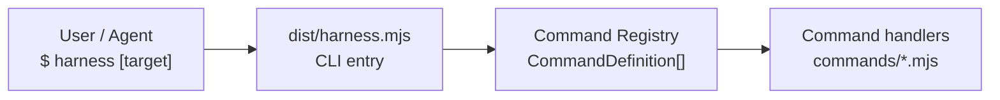
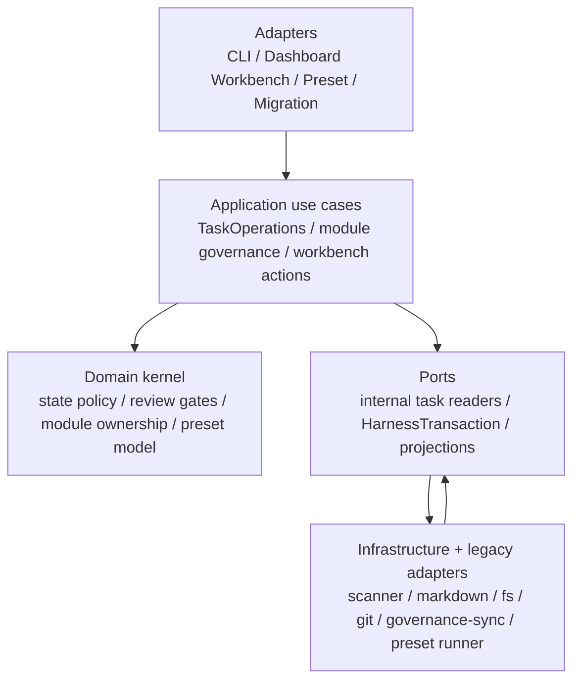
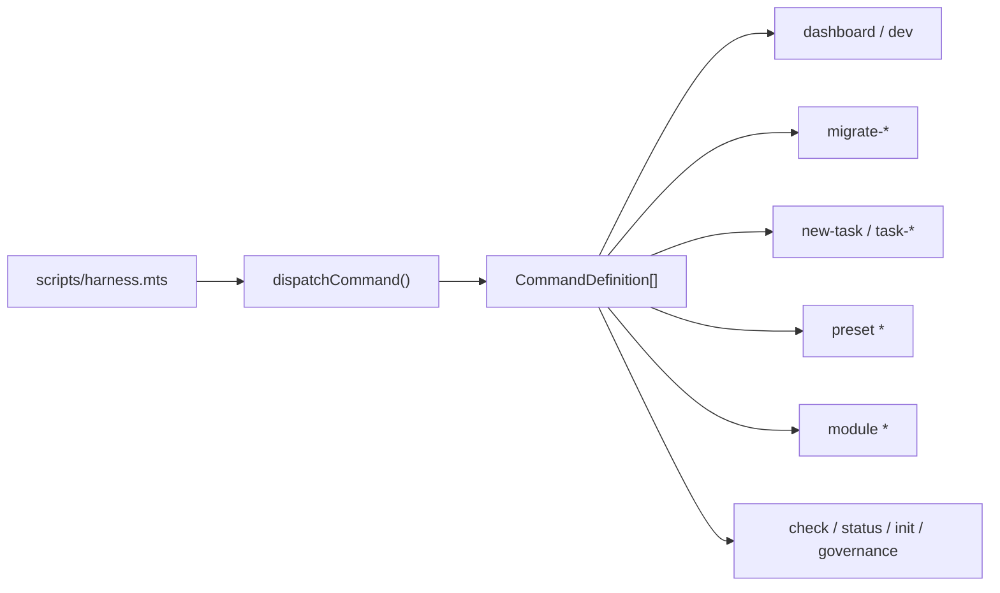
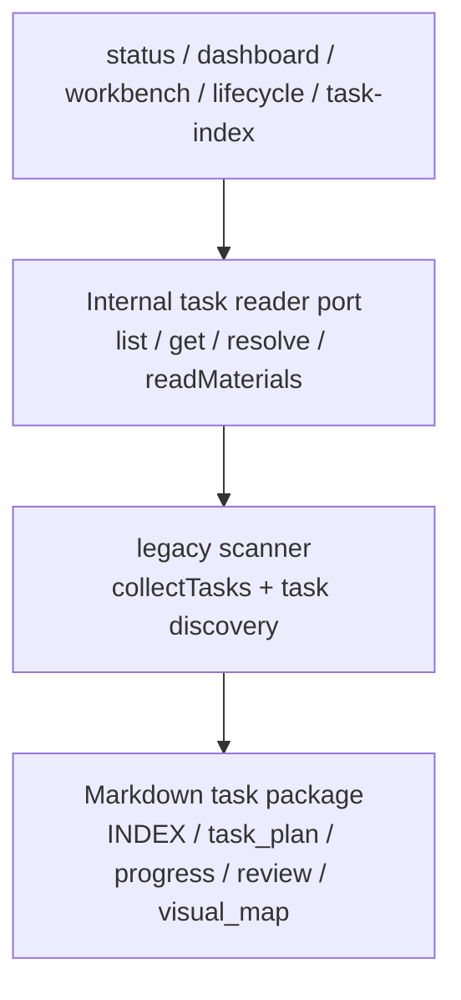
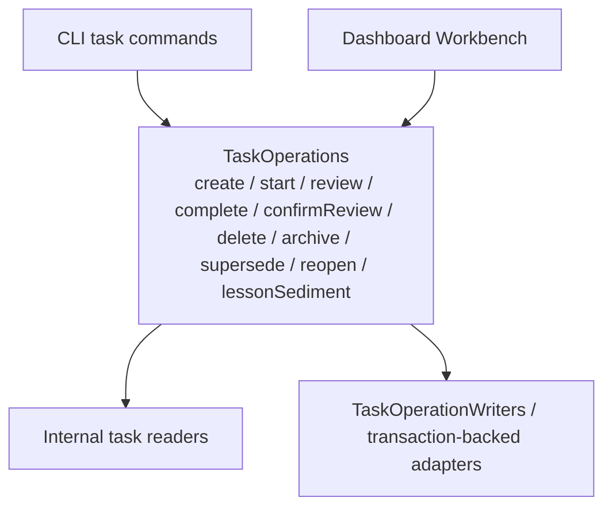
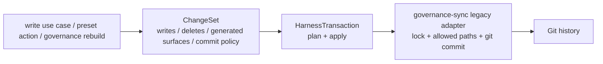
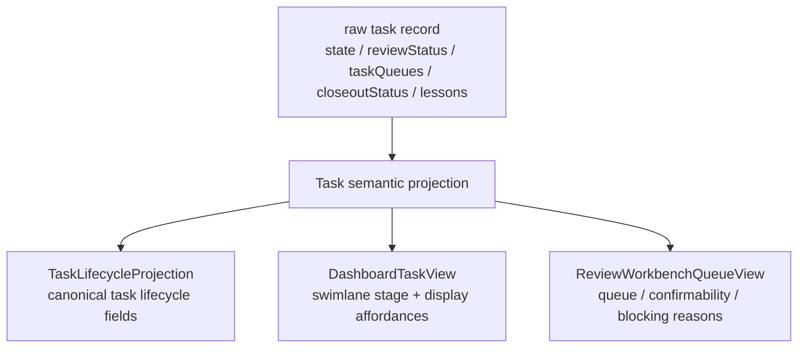

# 02 — Code Module Dependencies

## Level 0 — Where the entry point is

All commands come through a single file:

`harness.mjs` only passes arguments into the command registry. Command name,
usage, flags, positionals, and handler are registered in `CommandDefinition`;
help output is generated from the same registry. Adding a command is no longer
an if/else and hand-written help edit across several places.

---

## Level 1 — Current layering

After the lower-level refactor, the public architecture is no longer a flat set
of six functional modules. It is a facade-first ports/adapters structure. The
old scanner, governance-sync, and preset runner still exist, but they are
infrastructure / legacy adapters rather than internals that CLI or Dashboard
should call around the business layer.

Dependencies point inward: adapters own protocol and presentation, application
use cases own business actions, the domain owns rules, ports define seams, and
infrastructure implements file-system, Git, Markdown, and legacy scanning.

---

## Level 2 — Command Registry

`commands/registry.mts` is the source of truth for the command surface. It
declares each command's name, usage, flag schema, positionals, and handler.
Complex commands still dispatch into `dashboard-command.mts`,
`migration-command.mts`, `task-command.mts`, `preset-command.mts`, and
`module-command.mts`, but registration and help text are not scattered through
the entry file.

---

## Level 2 — Task read path: internal readers

The task reader port is an internal read seam. Scanner-backed implementations
may still exist behind this adapter, but active callers should depend on
semantic task views rather than scanner discovery details. The internal reader
exposes four capabilities:

| Method | Purpose |
| --- | --- |
| `list(query)` | List tasks with state, module, queue, preset, review, and lesson filters |
| `get(ref)` | Read one task by id or path |
| `resolve(ref)` | Resolve a task reference to its directory and `task_plan.md` path |
| `readMaterials(ref)` | Read reviewable Markdown files from the task package |

This adapter lets future scanner internals change without editing Dashboard,
Workbench, check, and lifecycle callers one by one. It is not a public package
import surface; consumers should use the CLI, generated JSON, Dashboard output,
or documented preset/template entrypoints.

---

## Level 2 — Task write path: TaskOperations

`TaskOperations` is the application use-case layer. Both CLI and Dashboard
Workbench go through it for task actions, so rules such as review confirmability,
task completion, and open blocking findings do not fork across entry points.

Write-specific compatibility modules are adapter-owned and transaction-scoped.
They are not business interfaces for CLI or Dashboard callers.

---

## Level 2 — Write transaction: HarnessTransaction

`HarnessTransaction` gives write planning, allowed paths, generated surfaces,
dirty-tree checks, dry-run behavior, and Git commit results a named boundary.
Its core types are:

| Type | Role |
| --- | --- |
| `ChangeSet` | Declares writes, deletes, generated surfaces, and commit policy |
| `TransactionPlan` | Normalized plan with allowed paths, generated surfaces, Git state, and conflicts |
| `TransactionResult` | Success/failure, written paths, commit result, and lock release state |

This is not a new source of truth. Transactions manage write safety and commit
boundaries; task facts still come from Markdown under `coding-agent-harness/`.

---

## Level 2 — Semantic projection: Task Semantic Projection

Task semantic projection solves the problem where status, Dashboard, Workbench,
and generated indexes each interpret the same review concept differently. It
wraps the raw task record into three view models:

| Projection | Consumers | Must not do |
| --- | --- | --- |
| `TaskLifecycleProjection` | status JSON, task-index, Dashboard, governance rows | write back to source files |
| `DashboardTaskView` | task list, detail drawer, swimlane | reinvent lifecycle rules in the frontend |
| `ReviewWorkbenchQueueView` | review workbench, bulk confirmation actions, review queue views | recalculate blocking risks from Markdown |

Projection may be written as generated JSON or cached, but it is not
authoritative. Deleting it must not change task semantics; it must be rebuildable
from the task files.

---

## Level 3 — Where legacy modules still fit

Many file names still live under `scripts/lib/`. This keeps the refactor
verifiable and reversible instead of moving everything at once. Their current
roles are:

| Module | Current role |
| --- | --- |
| `task-scanner.mts` / `task-review-model.mts` | Legacy read implementation behind internal task readers |
| `governance-sync.mts` | Legacy write / commit adapter behind HarnessTransaction |
| `task-lifecycle.mts` | Still performs some Markdown writes while TaskOperations and transaction adoption continue |
| `dashboard-data.mts` / `dashboard-workbench.mts` | Dashboard adapter and projection consumer |
| `preset-runner.mts` | Preset adapter, converging toward ChangeSet / transaction execution |

When reading the code, first ask which adapter calls which use case, then which
port the use case depends on. Only port legacy implementations should directly
touch scanner internals, Markdown file details, or governance-sync.

---

## Next

- For task lifecycle, read [03-task-lifecycle.md](03-task-lifecycle.md)
- For checks and governance, read [04-check-and-governance.md](04-check-and-governance.md)
- For Dashboard data flow and projection, read [05-data-flow.md](05-data-flow.md)
