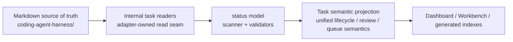
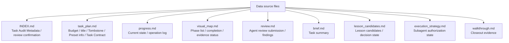
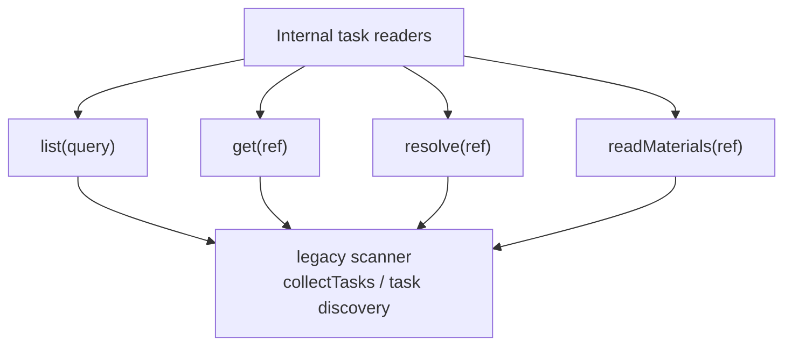
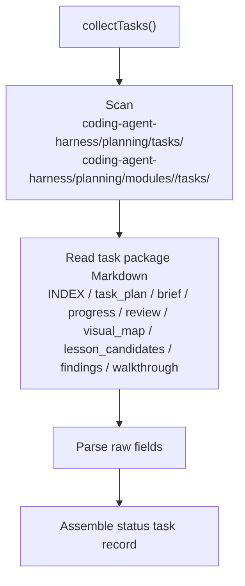
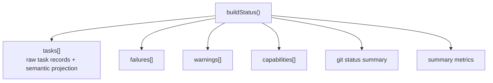
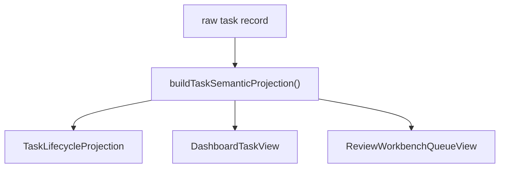
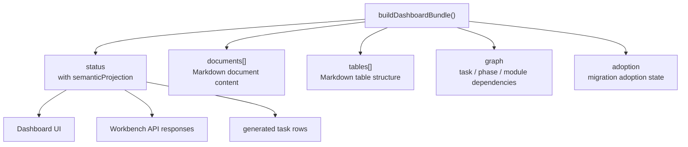
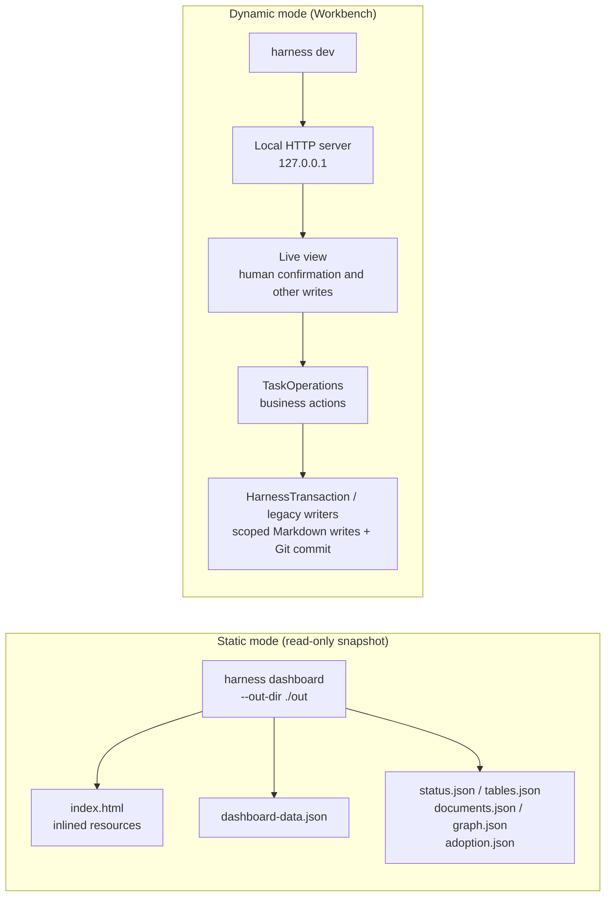

# 05 — Data Flow: From Markdown to Dashboard

## Level 0 — Where data starts and ends

Authoritative facts live only in Markdown files under `coding-agent-harness/`.
Scanner output, status JSON, Dashboard bundles, generated indexes, and
projections are rebuildable views. They may be cached or written to disk, but
they must not become a second source of truth.

---

## Level 1 — Which files are data sources

Generated `Harness-Ledger.md`, task-index, module-index, Closeout index, and
Dashboard JSON are not hand-written sources. They support browsing, review, and
context recovery, but must be rebuildable from the source files.

---

## Level 2 — How internal task readers read tasks

Internal task readers wrap scanner-backed discovery where needed. Public and
application callers should see semantic task views and reviewable materials, not
`listTaskPlanPaths()`, directory exclusion rules, or legacy visual-map fallback
internals.

### Task discovery flow

The scanner still parses Markdown tables, state, phases, review submission,
confirmation, lesson decisions, and tombstones as an infrastructure adapter. The
post-refactor boundary is that UI, command, and generated surfaces must not
re-interpret those raw fields on their own.

---

## Level 2 — What status output contains

`buildStatus()` assembles machine-readable state from repository/scanner output
and validator output:

Each task record still keeps raw fields such as `state`, `reviewStatus`,
`reviewQueueState`, `taskQueues`, `closeoutStatus`, `materialsReady`, and
`lessonCandidateDecisionComplete`. These fields are useful for debugging, but
Dashboard and generated governance rows should prefer semantic projection.

---

## Level 2 — Task Semantic Projection

Projection wraps one raw task record into three explicit views:

| Projection | Core fields | Consumers |
| --- | --- | --- |
| `TaskLifecycleProjection` | `state`, `lifecycleState`, `reviewStatus`, `reviewQueueState`, `closeoutStatus`, `taskQueues`, `materialsReady`, `reviewSubmitted`, `deletionState` | status JSON, task-index, generated governance rows |
| `DashboardTaskView` | `visibleInSwimlane`, `swimlaneStage`, `needsEvidence`, `reasonCode`, `reasonMessage` | Dashboard task list, detail drawer, swimlane |
| `ReviewWorkbenchQueueView` | `primaryQueue`, `humanConfirmable`, `blocked`, `needsMaterials`, `confirmed`, `finalized`, `readyForCloseout`, `reasonCodes` | Review Workbench, bulk confirmation, review queue |

This boundary prevents the same task from having different meanings in top-line
stats, lifecycle workbench, swimlanes, and review tables. The frontend may decide
layout, color, and filtering, but it must not redefine whether a task is
review-ready, blocked, confirmed, or finalized.

---

## Level 3 — How the Dashboard bundle uses projection

Dashboard bundle adds documents, tables, graph, and adoption analysis on top of
status. Task lifecycle, review queue, swimlane stage, and confirmability should
come from projection, not from mixing raw `state`, `reviewStatus`, and
`taskQueues` again in `app.js` or Workbench handlers.

### documents collection scope

`collectMarkdownDocuments()` still collects fixed governance files, task package
files, module files, and lesson files. Those documents support human reading and
table browsing; they do not change task lifecycle semantics.

---

## Level 2 — Two Dashboard generation modes

The static Dashboard is a shareable evidence snapshot and cannot trigger writes.
Workbench is local-only. Writes must pass host/origin/CSRF checks,
TaskOperations business gates, and scoped write boundaries.

---

## Level 3 — Role of markdown-utils.mjs

`markdown-utils.mjs` remains the low-level Markdown table parsing foundation. It
extracts rows, locates columns, reads cells, splits lists, and splits dependencies.
It does not decide whether a task is confirmable, complete, or in the review queue.

---

## Level 2 — Design decisions

### Why projection is not source of truth

Projection is a named view over the raw task record. It eliminates semantic drift
across consumers, but it must not be hand-written and must not bypass task files.
After deleting generated JSON or Dashboard output, running scanner/status again
should produce an equivalent projection.

### Why Dashboard remains plain HTML + vanilla JS

harness is distributed through `npx`. Introducing React/Vite would make each run
pull build dependencies and break zero-dependency portability. Static HTML can
open from `file://` and can be shared as a CI evidence snapshot.

### Why the static Dashboard is read-only

Static Dashboard has no safety boundary and is meant for sharing and review.
Writes only run in local Workbench mode, where the server can validate host,
origin, CSRF, Git state, and allowed paths.
