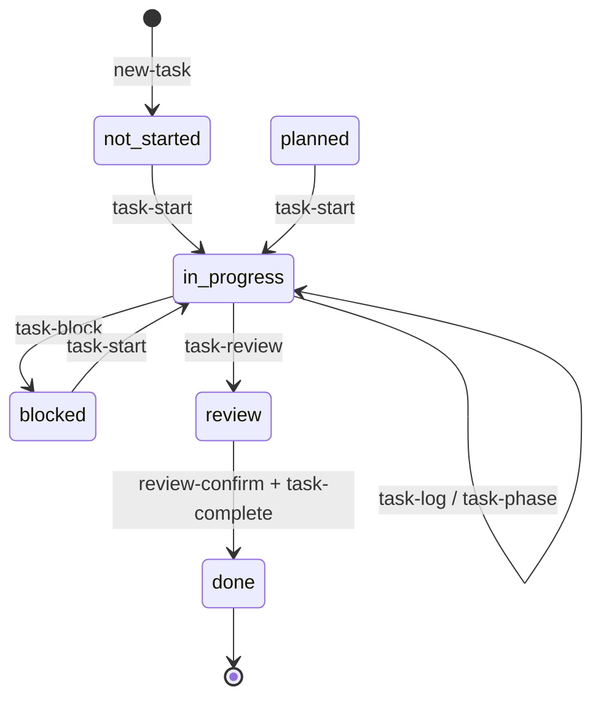
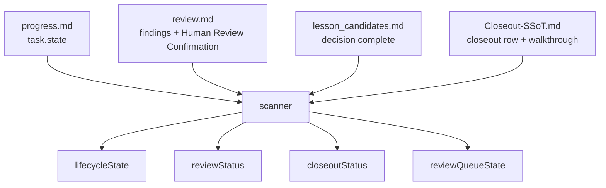
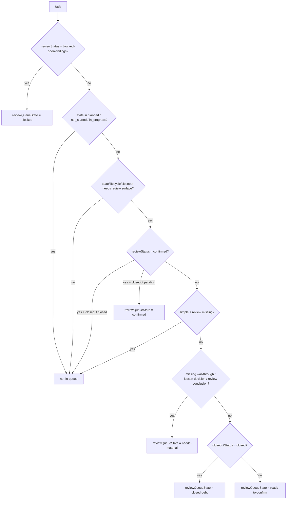
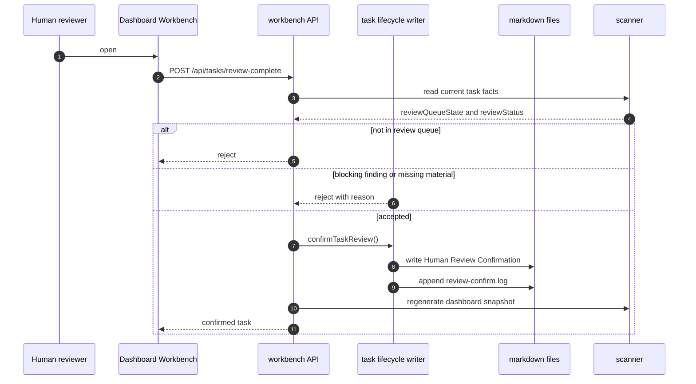

# Task State Machine And Review Queue

Chinese mirror: `docs-release/guides/task-state-machine.md`

Coding Agent Harness does not model task state as a single field. The Dashboard derives the visible state from multiple files:

- `progress.md` stores the raw `task.state`.
- `review.md` stores agent review notes, P0-P2 findings, and human confirmation.
- `lesson_candidates.md` records whether lesson candidate review is complete.
- `10-WALKTHROUGH/Closeout-SSoT.md` records closeout status and links walkthrough evidence.
- The scanner derives `lifecycleState`, `reviewStatus`, `closeoutStatus`, and `reviewQueueState` from those files.

## Raw Task Command Flow

`done` is only the raw task state. It does not mean human review and closeout are complete.

## Derived State

| Field | Source | Purpose |
| --- | --- | --- |
| `task.state` | `progress.md` | Execution stage. |
| `reviewStatus` | `review.md` + findings + human confirmation | Separates missing review, agent review, blocking findings, and human confirmation. |
| `closeoutStatus` | `Closeout-SSoT.md` | Separates missing, pending, and closed closeout. |
| `lifecycleState` | scanner-derived | Dashboard lifecycle meaning. |
| `reviewQueueState` | scanner-derived | Whether `#/review` includes the task and which bucket it belongs to. |

## Lifecycle Matrix

| Condition | `lifecycleState` | Meaning |
| --- | --- | --- |
| `reviewStatus = blocked-open-findings` | `review-blocked` | An open P0-P2 finding blocks human confirmation. |
| `closeoutStatus = closed` and `reviewStatus != confirmed` | `closed-review-pending` | Closed but missing human confirmation. It must enter the review queue. |
| `closeoutStatus = closed` and `reviewStatus = confirmed` | `closed` | Truly closed. |
| `task.state = done` and closeout is not closed | `closing` | Raw task work is done, but closeout is not complete. |
| `task.state = review` | `in_review` | Execution review stage. |
| `task.state = blocked` | `blocked` | Execution is blocked. |
| `task.state = in_progress` | `active` | Work is active. |
| `task.state = planned/not_started` | `ready` | Work has not started. |

## Review Status

| `reviewStatus` | Meaning |
| --- | --- |
| `missing` | No review document is available. |
| `required` | Review document exists, but has no clear agent review verdict or human confirmation. |
| `agent-reviewed` | An agent or coordinator wrote a review verdict. This is not human confirmation. |
| `blocked-open-findings` | There is an open P0-P2 finding or a finding that blocks release. |
| `confirmed` | `Human Review Confirmation` exists. |

Agent review is not human confirmation. Only `review-confirm` or a Dashboard Workbench confirmation writes the `Human Review Confirmation` block.

## Review Queue

`#/review` is the human review workbench. It is not limited to tasks currently in the raw `review` stage. It also shows closed tasks that still need human confirmation.

| `reviewQueueState` | Dashboard meaning |
| --- | --- |
| `not-in-queue` | Do not show in the review queue. |
| `needs-material` | Needs walkthrough, lesson decision, or review conclusion. |
| `ready-to-confirm` | Material is ready for human confirmation. |
| `closed-debt` | Already closed, but missing human confirmation. |
| `blocked` | Has blocking review findings. |
| `confirmed` | Human-confirmed, but may still be waiting for task completion or closeout. |

## Human Confirmation Loop

The rule is intentionally strict: an agent can prepare review evidence, but a task is not human-confirmed until the human confirmation block exists.
