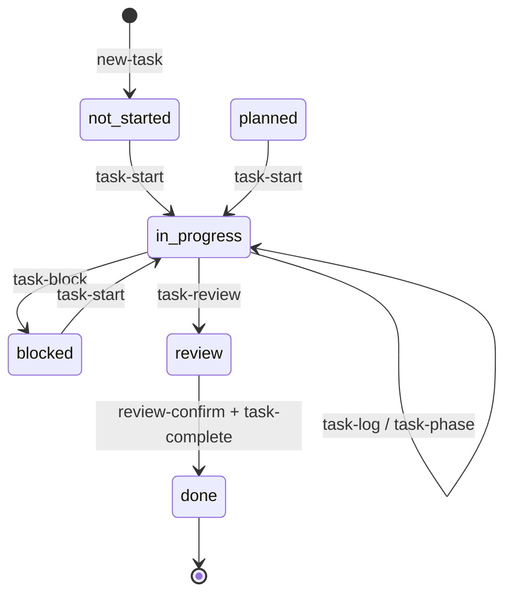
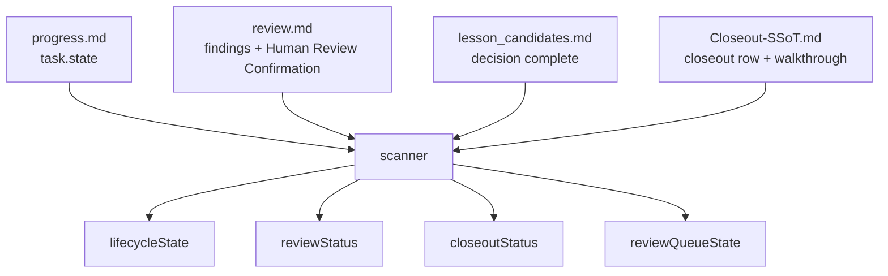
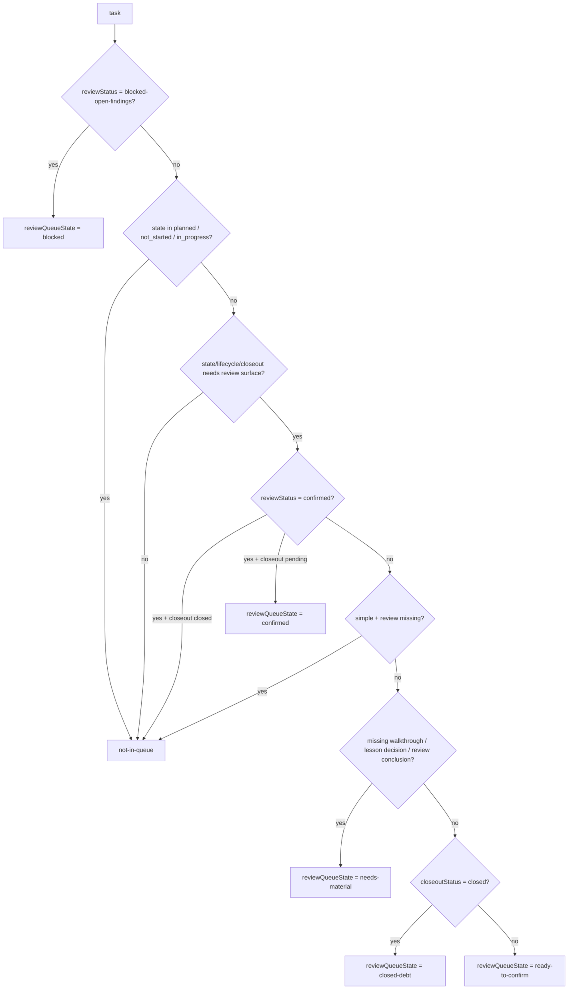
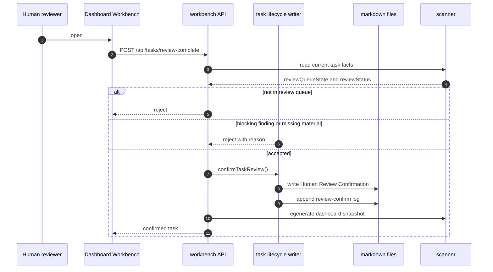

# 任务状态机与审查队列

English mirror: `docs-release/guides/task-state-machine.en-US.md`

Coding Agent Harness 的任务状态不是一个单字段。Dashboard 里看到的结果由多个文件共同推导：

- `progress.md` 记录原始 `task.state`。
- `review.md` 记录 agent 审查记录、P0-P2 findings 和人工确认。
- `lesson_candidates.md` 记录经验候选是否完成判定。
- `10-WALKTHROUGH/Closeout-SSoT.md` 记录任务是否完成收口，并链接 walkthrough。
- Scanner 从这些文件推导 `lifecycleState`、`reviewStatus`、`closeoutStatus` 和 `reviewQueueState`。

## 原始任务命令流

`done` 只是原始任务状态。它不代表任务已经完成所有人工审查和收口。

## 派生状态

| 字段 | 来源 | 作用 |
| --- | --- | --- |
| `task.state` | `progress.md` | 任务执行阶段。 |
| `reviewStatus` | `review.md` + findings + human confirmation | 区分缺审查、Agent 自查、阻塞、人工确认。 |
| `closeoutStatus` | `Closeout-SSoT.md` | 区分收口缺失、待处理、已关闭。 |
| `lifecycleState` | scanner 派生 | Dashboard 的生命周期语义。 |
| `reviewQueueState` | scanner 派生 | `#/review` 是否收录，以及收录到哪个分桶。 |

## 生命周期矩阵

| 条件 | `lifecycleState` | 含义 |
| --- | --- | --- |
| `reviewStatus = blocked-open-findings` | `review-blocked` | P0-P2 open finding 阻塞人工确认。 |
| `closeoutStatus = closed` 且 `reviewStatus != confirmed` | `closed-review-pending` | 已收口但缺人工确认，需要进入审查队列。 |
| `closeoutStatus = closed` 且 `reviewStatus = confirmed` | `closed` | 真正关闭。 |
| `task.state = done` 且 closeout 未 closed | `closing` | 原始任务已完成，但收口未闭合。 |
| `task.state = review` | `in_review` | 执行审查阶段。 |
| `task.state = blocked` | `blocked` | 执行阻塞。 |
| `task.state = in_progress` | `active` | 执行中。 |
| `task.state = planned/not_started` | `ready` | 准备中。 |

## 审查状态

| `reviewStatus` | 含义 |
| --- | --- |
| `missing` | 没有可用 review 文档。 |
| `required` | 有 review 文档，但还没有明确的 agent 审查结论或人工确认。 |
| `agent-reviewed` | Agent 或 coordinator 写过审查结论，但还不是人工确认。 |
| `blocked-open-findings` | 有 open P0-P2 finding，或 finding 阻塞发布。 |
| `confirmed` | 已写入 `Human Review Confirmation`。 |

Agent 自查不等于人工确认。只有 `review-confirm` 或 workbench 的人工确认动作会写入 `Human Review Confirmation`。

## 审查队列

`#/review` 是人工审查工作台，不只是执行中的 `review` 阶段。它也显示已经收口但缺人工确认的审查债务。

| `reviewQueueState` | Dashboard meaning |
| --- | --- |
| `not-in-queue` | 不需要显示在审查队列。 |
| `needs-material` | 需要补 walkthrough、lesson decision 或 review 结论。 |
| `ready-to-confirm` | 材料齐全，可以人工确认。 |
| `closed-debt` | 已收口但缺人工确认，需要补确认。 |
| `blocked` | 有阻塞性 review finding。 |
| `confirmed` | 已人工确认，但可能还在等待后续 complete/closeout。 |

## 人工确认闭环

The rule is intentionally strict: an agent can prepare review evidence, but a task is not human-confirmed until the human confirmation block exists.
